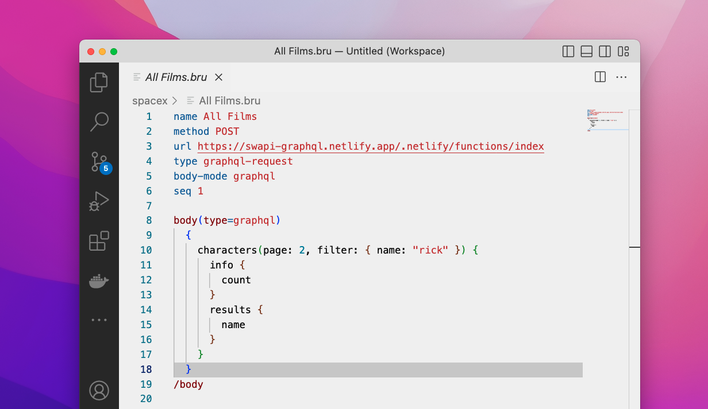
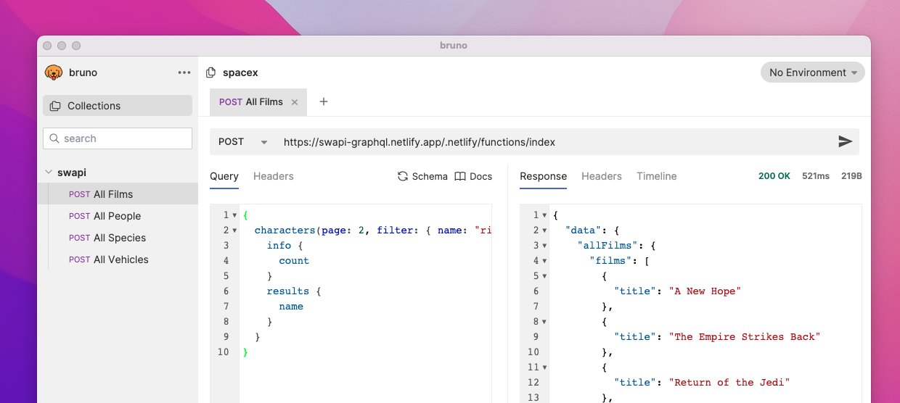

# bruno

Bruno is an Opensource IDE for exploring and testing apis

Bruno saves all your request on top of your filesystem in a eloquent domain specific language designed for storing api request data

## Features
This plugin provides the syntax highlight feature for .bru files

You can download the desktop app at our [website](https://www.usebruno.com)

## Release Notes

### 1.0.0

Initial release of Bruno extension!

## For more information

* [Github Project](https://github.com/usebruno/bruno)
* [Bruno](https://usebruno.com/)

*Enjoy!*
